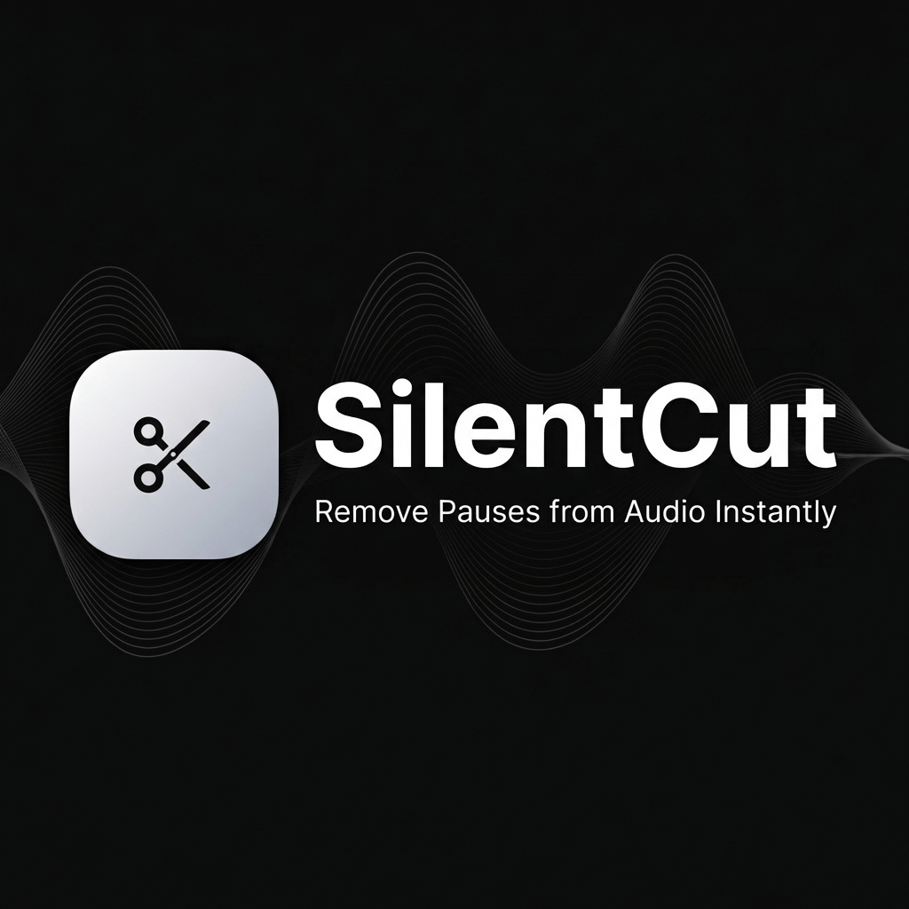

# SilentCut Studio

**Remove pauses and dead air from audio instantly.**

A privacy-first, browser-based audio editing tool that detects and removes silent pauses from audio files. Perfect for podcasters, YouTubers, AI voice users, and content creators.



---

## ✨ Features

- **🎯 Instant Pause Detection** - Automatically finds silent pauses in seconds
- **👁️ Visual Waveform Editor** - See and interact with your audio visually
- **🔍 Zoom Controls** - Zoom in/out (1x-4x) for detailed editing
- **📱 Mobile Optimized** - Fixed playhead with scrolling waveform on mobile
- **🔒 100% Private** - All processing happens in your browser, files never leave your device
- **💰 Free to Use** - No login, no ads, no limits
- **📥 Multiple Formats** - Export to MP3, WAV, M4A, OGG

---

## 🚀 Getting Started

### Prerequisites

- Node.js 18+ 
- npm or yarn

### Installation

```bash
# Clone the repository
git clone https://github.com/yourusername/silentcut-studio.git

# Navigate to project directory
cd silentcut-studio

# Install dependencies
npm install

# Start development server
npm run dev
```

Open [http://localhost:3000](http://localhost:3000) to view the app.

### Build for Production

```bash
npm run build
npm run start
```

---

## 🛠️ Tech Stack

| Technology | Purpose |
|------------|---------|
| **Next.js 16** | React framework with App Router |
| **TypeScript** | Type-safe JavaScript |
| **Tailwind CSS v4** | Utility-first styling |
| **Web Audio API** | Audio processing & analysis |
| **FFmpeg.wasm** | Client-side audio encoding |
| **Framer Motion** | Animations |
| **Radix UI** | Accessible UI components |
| **Lucide Icons** | Icon library |

---

## 📁 Project Structure

```
silentcut-studio/
├── app/                    # Next.js App Router
│   ├── page.tsx           # Main page (landing + editor)
│   ├── layout.tsx         # Root layout with SEO metadata
│   ├── globals.css        # Global styles
│   ├── robots.ts          # robots.txt generation
│   ├── sitemap.ts         # sitemap.xml generation
│   ├── privacy/           # Privacy policy page
│   └── terms/             # Terms of service page
│
├── components/
│   ├── WaveformDisplay.tsx    # Canvas waveform with zoom
│   ├── PlaybackControls.tsx   # Play/pause, volume, speed
│   ├── PauseList.tsx          # List of detected pauses
│   ├── UploadZone.tsx         # Drag & drop file upload
│   ├── DownloadPanel.tsx      # Export options
│   ├── SettingsModal.tsx      # Detection threshold settings
│   ├── JsonLd.tsx             # Structured data for SEO
│   ├── dashboard/             # Dashboard components
│   ├── landing/               # Landing page sections
│   └── ui/                    # Reusable UI components
│
├── hooks/
│   ├── useAudioProcessing.ts  # Audio file loading
│   ├── useSilenceDetection.ts # Pause detection algorithm
│   ├── useWaveform.ts         # Waveform data generation
│   └── useAudioVisualizer.ts  # Real-time frequency data
│
├── lib/
│   ├── audioUtils.ts          # Audio buffer utilities
│   ├── silenceDetector.ts     # Core detection algorithm
│   ├── ffmpegHelper.ts        # FFmpeg.wasm wrapper
│   └── constants.ts           # App constants
│
├── public/
│   ├── og-image.png           # Social sharing image
│   ├── manifest.json          # PWA manifest
│   ├── llms.txt               # LLM discovery file
│   ├── favicon.ico            # Favicon
│   └── logo.png               # App logo
│
└── types/
    └── audio.ts               # TypeScript interfaces
```

---

## 🔊 How It Works

### 1. Audio Upload
- User uploads audio file (MP3, WAV, M4A, OGG, WEBM)
- File is read using `FileReader` API
- Audio decoded via Web Audio API's `AudioContext`

### 2. Silence Detection Algorithm
```
1. Load audio into AudioContext
2. Extract audio buffer data
3. Process in chunks (512 samples)
4. Calculate RMS (Root Mean Square) for each chunk
5. Convert to dB: 20 × log10(RMS)
6. Compare against threshold (default: -40dB)
7. Track consecutive frames below threshold
8. If duration > minDuration (0.5s), mark as pause
9. Return pause segments: [{start, end, duration}]
```

### 3. Waveform Visualization
- Canvas API draws the waveform
- **Desktop**: Full waveform view with moving playhead
- **Mobile**: Fixed playhead at center, waveform scrolls underneath
- Zoom levels: 1x, 1.5x, 2x, 3x, 4x

### 4. Pause Selection
- Users review detected pauses
- Toggle individual pauses to keep/remove
- Bulk actions: Select All / Deselect All
- Visual preview of selected pauses on waveform

### 5. Audio Export
```
1. Calculate "keep segments" (inverse of removed pauses)
2. Extract audio data for each segment
3. Concatenate into new AudioBuffer
4. Convert to WAV using audioBufferToWav()
5. Use FFmpeg.wasm to encode final format
6. Trigger browser download
```

---

## ⚙️ Configuration

### Detection Settings

| Setting | Default | Range | Description |
|---------|---------|-------|-------------|
| Threshold | -40 dB | -50 to -20 dB | Volume level considered "silent" |
| Min Duration | 0.5s | 0.2 to 5.0s | Minimum pause length to detect |

### Export Options

| Format | Bitrates Available |
|--------|-------------------|
| MP3 | 128k, 192k, 256k, 320k |
| WAV | Lossless |
| M4A | 128k, 192k, 256k, 320k |
| OGG | 128k, 192k, 256k, 320k |

---

## 🔒 Privacy

SilentCut is **100% client-side**. Your audio files:
- Never leave your device
- Are not uploaded to any server
- Are processed entirely in your browser
- Are discarded when you close the tab

We use FFmpeg.wasm for encoding, which runs locally via WebAssembly.

---

## 📈 SEO & Discoverability

| File | Purpose |
|------|---------|
| `robots.ts` | Search engine crawler rules |
| `sitemap.ts` | XML sitemap for search engines |
| `JsonLd.tsx` | Structured data (Schema.org) |
| `llms.txt` | LLM/AI assistant discovery |
| `manifest.json` | PWA support |
| `og-image.png` | Social sharing preview |

---

## 🎨 Design System

- **Theme**: Black and white minimalist
- **Background**: Pure black (#000000)
- **Text**: White (#FFFFFF)
- **Accents**: White with opacity variations
- **Pause Highlights**: Red (#FF3333)
- **Font**: Inter, Geist Sans

---

## 📱 Responsive Design

| Breakpoint | Behavior |
|------------|----------|
| Mobile (<768px) | Fixed playhead, scrolling waveform, simplified controls |
| Tablet (768-1024px) | Hybrid layout |
| Desktop (>1024px) | Full waveform view, side panel for pause list |

---

## 🧪 Browser Support

- Chrome 90+
- Firefox 90+
- Safari 15+
- Edge 90+

Requires:
- WebAssembly support
- Web Audio API
- SharedArrayBuffer (for FFmpeg.wasm)

---

## 📄 License

MIT License - see [LICENSE](LICENSE) for details.

---

## 🤝 Contributing

1. Fork the repository
2. Create a feature branch (`git checkout -b feature/amazing-feature`)
3. Commit your changes (`git commit -m 'Add amazing feature'`)
4. Push to the branch (`git push origin feature/amazing-feature`)
5. Open a Pull Request

---

## 📧 Support

- Website: [https://silentcut.studio](https://silentcut.studio)
- Email: silentcut@silentcut.studio

---

**Made with ❤️ for podcasters, YouTubers, and content creators everywhere.**